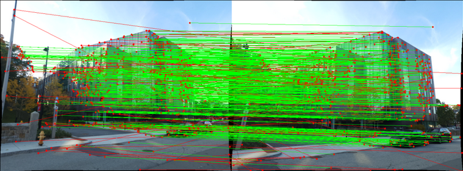
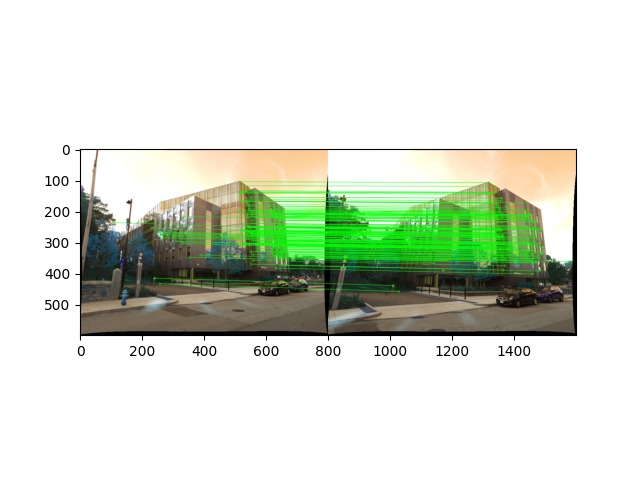
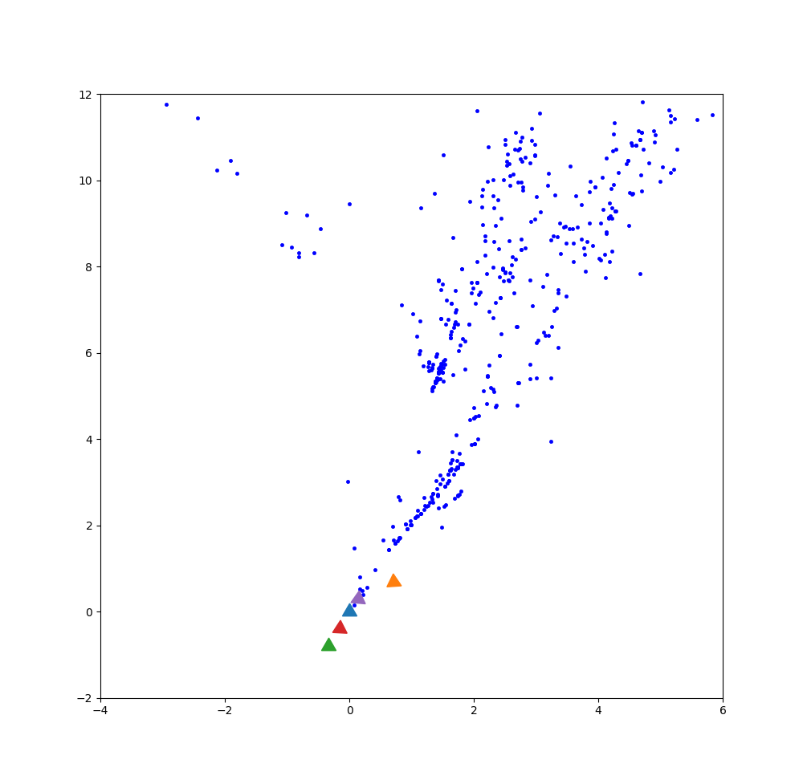
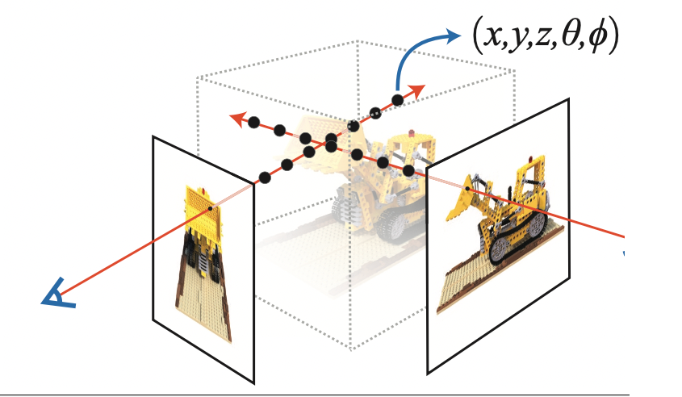
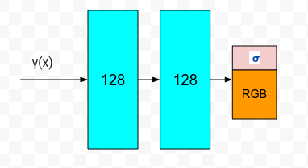
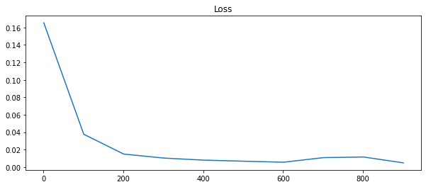

# StructureFromMotion3DReconstruction
Reconstruct a 3D scene and simultaneously obtain the camera poses using Structure from Motion.

# Building built in minutes- SfM and NeRF

Phase 1: Reconstructed a 3D scene and simultaneously obtained the camera poses of a monocular camera from a set of images
with different view points using feature point correspondences (classical CV).

Phase 2: Used Neural Radiance fields (NeRF) to synthesize novel views of complex scenes by optimizing a continuous
volumetric scene function using a sparse set of input views (Deep Learning)


## Phase 1 - Structure from Motion:

There are a few steps that collectively form SfM:

* Feature Matching and Outlier rejection using RANSAC
* Estimating Fundamental Matrix
* Estimating Essential Matrix from Fundamental Matrix
* Estimate Camera Pose from Essential Matrix
* Check for Cheirality Condition using Triangulation
* Perspective-n-Point
* Bundle Adjustment


### Input:
The data given to us is a set of 5 images of Unity Hall at WPI, using a Samsung S22 Ultra’s primary camera at f/1.8 aperture, ISO 50 and 1/500 sec shutter speed.


The data folder contains 4 matching files named matching*.txt where * refers to numbers from 1 to 5. For eg., matching3.txt contains the matching between the third image and images that come after, i.e., I3↔I4,I3↔I5. This is the reason image 5 does not have a text file.

### Initial Feature matching


### Outlier Rejectiong - RANSAC (using Fundamental matrix)


### Cheirality check


### Triangulation(1 & 2) using Correct Camera pose


### After Perspective-n-Point and Bundle Adjustment



### Usage Guidelines:

1. Run
```
python3 Wrapper.py
```

#### Outputs:

1. All Intermediate Images Output are saved in Phase1-> Data-> IntermideateOutputs

#### Input and Output Data

1. You can change the savepath loacation and Data path in Arg-Parser


## Phase 2 - NeRF:
Implementing the original NERF method [from this paper](https://arxiv.org/abs/2003.08934).

### Input:
Download the lego data for NeRF from the original author’s link [here](https://drive.google.com/drive/folders/1lrDkQanWtTznf48FCaW5lX9ToRdNDF1a)

#### Sample input



### Neural Network used


### Training


### Result on Test set


### Usage Guidelines:

#### Training:
1. Change the directory to Phase 2.
2. To train the NeRF model on GPU:

```
python3 NeRF_train.py
```
3. Output of Loss plot will be saved in Results folder.

#### Testing
1. Change the directory to Phase 2.
2. To test the model:

```
python3 NeRF_test.py
```
3. Output video will be saved in the same directory.


## References:
1. https://rbe549.github.io/fall2022/proj/p3/
2. https://arxiv.org/abs/2003.08934


